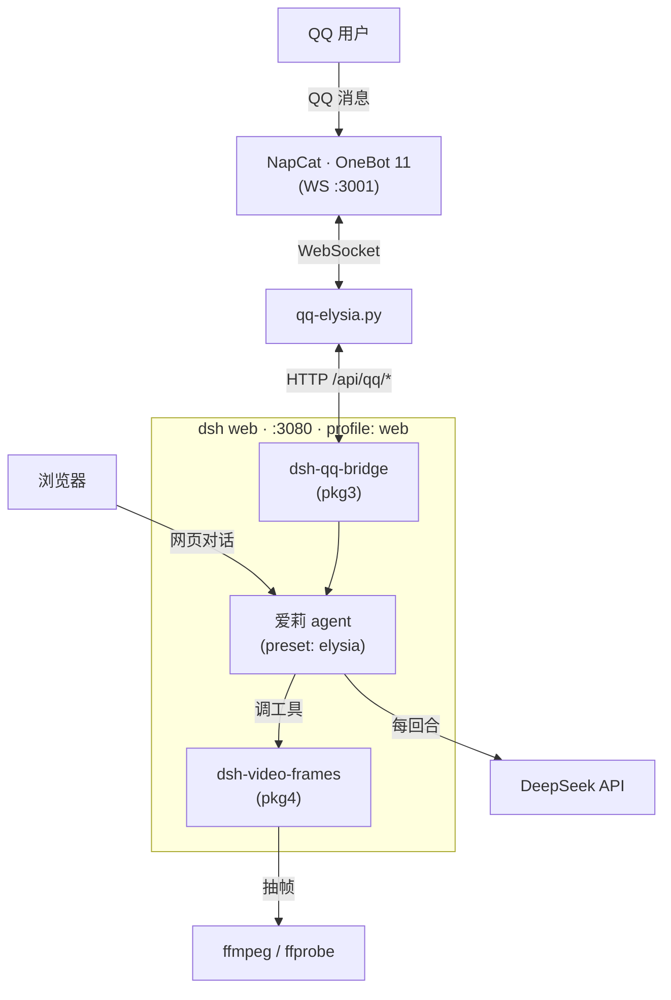

# Elysia-DSH-Pack

> 把 [DeepSeek Harness](https://github.com/deepseek-ai/deepseek-harness) 变成爱莉希雅 ——
> 人格 + QQ 接入打包成一键安装，给不想碰命令行的人用。

装完之后，爱莉在浏览器（`http://127.0.0.1:3080`）和 QQ 里都能陪你聊天，还能读写文件、跑命令干活。
再装一个（可选的）视频包，网页里的爱莉还能"看"视频。

---

## ⚠️ 来源说明（先看这段）

**这不是原创项目，是从一份在 B 站一带流传的整合包魔改来的。**

那份包把「dsh 本体 + 爱莉希雅人格 + QQ 接入」打包成小白一键安装版，在网上流传。
**再往上的最初作者已经查不到了** —— 所以这里**不标注任何具体作者名**，免得张冠李戴
（把转载者说成原作者，同样是一种失实）。想找原始版本，B 站站内搜「**DeepSeek 爱莉希雅 整合包**」试试。

本仓库只对**自己改动的部分**负责，而改动其实不小：适配新版 dsh、重写 QQ 桥、新增视频包……
现在这份跟原包**已经差别很大了**（详见下面「这个改版改了什么」）。

**如果你是原作者，或知道上游是谁 —— 欢迎开 Issue 联系**，署名怎么算都可以谈。

**本仓库不包含的东西：**

- **声线素材（20 条 `g-01~20.wav`）** —— 那是《崩坏3》爱莉希雅的配音片段，版权不属于本项目，
  不便二次分发。需要的话请到原包处获取，放进 `voice-clips/` 即可被脚本识别。
  （`.gitignore` 已经把 `*.wav` 挡在外面了。）
- **dsh 本体** —— 由包1 安装脚本从 npm 现装，本仓库不含也不分发。
- **CosyVoice 语音引擎**（约 3GB）—— 需要自己下载，见包2 的 `docs/voice-guide.md`。

---

## 装什么

四个包，按顺序装：

| 包 | 作用 | 必须？ |
|---|---|---|
| **`elysia-pkg1-core.zip`** | 装 Node.js → `npm install -g @deepseek-ai/dsh@0.1.6-alpha.2` → 收 API Key → 后台起 `dsh web` → 生成桌面启动器 | ✅ 必须 |
| **`elysia-pkg2-elysia.zip`** | 装爱莉人格预设，设为默认 | 推荐 |
| **`elysia-pkg3-qq.zip`** | 接 QQ（需自备 [NapCat](https://github.com/NapNeko/NapCatQQ)） | 可选 |
| **`elysia-pkg4-video.zip`** | 视频理解：内容总结 / 抽帧 / 场景检测 / GIF / 元数据（需自备 [ffmpeg](https://www.gyan.dev/ffmpeg/builds/)，脚本会检查并给指引） | 可选 |

### 安装

1. 解压 `packages/` 里的 **`elysia-pkg1-core.zip`**，双击里面的 `install.bat`
2. （推荐）同理解压并双击 `elysia-pkg2-elysia.zip`
3. （可选）同理解压 `elysia-pkg3-qq.zip` 并双击——需要先自己下载 NapCat
4. （可选）同理解压 `elysia-pkg4-video.zip` 并双击——机器上最好先装好 ffmpeg，
   没装脚本也会停下来给指引（推荐 `winget install Gyan.FFmpeg`）

每个包里都有一份 `README.md` 写详细步骤。

---

## 架构一览

一张图看懂装完之后各部件怎么连（`dsh web` 是内核，四个包往它上面叠）：



- **浏览器面**：直接和爱莉对话，能读写文件、跑命令（内核自带的能力）。
- **QQ 面**（pkg3）：QQ 消息经 NapCat 转成 OneBot 协议 → `qq-elysia.py` 转发进 `dsh web` → 爱莉的回复再原路发回 QQ。
- **视频线**（pkg4）：爱莉调 `video_analyze` → `ffmpeg` 抽关键帧 → 喂视觉模型 → 返回画面描述。
- **大脑**：所有回合最终都打到 DeepSeek API（装了 pkg4 时，总结画面用的是支持图像的 `deepseek-flash`）。

**四个包分别叠在哪：**

```
web profile 的 bundle 栈（从上到下即加载顺序）：

  dsh-base                ← dsh 内核自带
  dsh-web-app             ← 网页界面，dsh 自带
  dsh-qq-bridge           ← pkg3 装的
  dsh-video-frames        ← pkg4 装的
  profiles/web/cordis.patch.yml   ← 覆盖层（安装脚本写 agentPreset / cwd 等）

pkg1 = 把 dsh 本体 + web profile 装上、收 API Key、起服务
pkg2 = 往 ~/.dsh/.agent-presets/ 塞「爱莉」人格预设，并设为默认
```

---

## 这个改版改了什么

### 包1 · 核心包

- **钉死版本号**：原脚本写的是 `npm install -g @deepseek-ai/dsh`（不带版本），
  而 npm 的 `latest` 标签当时指向的是 `0.1.5-rc.3`，**不是**最新版。改成显式安装 `0.1.6-alpha.2`。
- **补装 pnpm**：`dsh plugin add` 内部转发给 pnpm，机器上没有 pnpm 会直接失败（exit 127）。

### 包2 · 人格包

预设 `preset/agent.cordis.yml` 三处，适配 0.1.6 的配置键变化：

```diff
-    text: |-
+    prefix: |-

-    - id: workflow-worker-thread
-      name: '@deepseek-ai/dsh-workflow-worker-thread'
+    - id: workflow-ptc
+      name: '@deepseek-ai/dsh-workflow-ptc'

     - id: tool-ralph
       name: '@deepseek-ai/dsh-tool-ralph'
+      disabled: true
```

### 包3 · QQ 包（改动最大）

原版插件是个 `cordis_define` 代码片段，靠用户**手动往会话里贴**。0.1.6 没这个工具了，所以整个重写：

| 项 | 原版 | 本版 |
|---|---|---|
| 装载方式 | 会话里贴代码片段 | 标准 bundle 插件，`dsh plugin add` 自动装 |
| 路由 `kind` | `'json'`（**非法值**，静默落进 prefix 表） | `'exact'` |
| 请求体读取 | 无上限 | 有界读取 |
| agent 归属 | 所有 QQ 用户**共用一条会话** | 一人一个 agent，上下文隔离 |
| 鉴权 | 无 | 支持共享 token |
| 回复通道 | 模型写 `reply.json` 文件，脚本轮询 | 订阅 `session/event` 事件流 → 内存队列 → HTTP 取 |
| 进程重启 | 会**重发**历史回复（刷屏） | 游标落盘，只发新的 |

顺带修了两个会让整条链路挂掉的问题：

- **人格包没装时，QQ 桥会整个崩掉** —— 预设挂载失败会连带回滚 agent 创建，现在降级成默认预设继续跑。
- **纯图片消息会收到误导提示**（"连接有点问题"）—— 现在如实回"看不见图片"。

### 包4 · 视频包（本仓库新增）

不是改原包，是**新增**：把独立插件 **dsh-video-frames**（未发布到 npm）打包成第 4 个安装包，
给纯文本的爱莉补上视频理解——抽帧 / 场景检测 / GIF / 元数据 / 视觉模型总结画面。

- **真机实测通过（5/5 工具）**：`video_analyze` 抽帧 → 喂视觉模型 → 返回**真实画面描述**
  （不是"看不到图"那种降级回复），其余四个工具逐一出真实产物（元数据 / 帧 / 切点 / GIF）。
- 安装脚本照包3 的路子（复制 → `npm install` → `dsh plugin add`），
  外加 **ffmpeg / ffprobe 的检查与指引**：只提示不自动装；还会识别 **2013 年那种能跑、但解不动手机 HEVC 的上古版本**。
- **只在网页面可用**——QQ 桥不支持传视频。

---

## 已知限制

- **图片**：不支持。发图片会被忽略，爱莉只看得见文字。
- **视频**：装了包4 才有，且**只在网页面**可用（QQ 桥不支持传图片/视频）；机器上需要有 `ffmpeg` 在 PATH
  （**太老的版本解不动手机拍的 HEVC**，建议从 [gyan.dev](https://www.gyan.dev/ffmpeg/builds/) 装新版）。
- **语音**：需要额外装 CosyVoice（约 3GB）+ ffmpeg。没装时**文字照发**，只是没有语音条。
- **只在 v0.1.6-alpha.2 上测过**，其他版本没验证。
- 验证口径：包1/2/3 在**模拟环境**（全新 DSH_HOME + NapCat 模拟器）端到端通过；
  包4 在**真 `dsh web`** 上加载无报错、工具真出结果（含 `video_analyze` 出真实画面描述）。
  **全部未在真 QQ 上实跑过**（需真人扫码登录，无法自动模拟）。

---

## 目录结构

```
packages/            # 四个可直接下载的安装包（解压双击 install.bat 即可）
src/                 # 同一份内容展开成源码，给想改/想审查的人
├── pkg1-core/
├── pkg2-elysia/
├── pkg3-qq/
└── pkg4-video/
```

`src/` 里每个包的 `setup.ps1` 是把 `install.bat` 里 base64 打包的 PowerShell **解码后的可读版本** ——
`install.bat` 本身是「提权 + 解码 + 执行」的外壳，逻辑全在 `setup.ps1` 里，想看改了什么直接 diff 这个。

---

## 致谢

- 原整合包：B 站上流传的那份魔改包（人格预设、安装脚本、QQ 桥的初版都出自它）
  —— 具体作者不明，见上面「来源说明」
- [DeepSeek Harness](https://github.com/deepseek-ai/deepseek-harness) —— 本体
- [CosyVoice](https://github.com/FunAudioLLM/CosyVoice) —— 语音合成
- [NapCat](https://github.com/NapNeko/NapCatQQ) —— QQ 协议
- 爱莉希雅 © 米哈游 —— 角色与配音素材版权归米哈游所有，本项目仅为非商业的同人爱好用途
